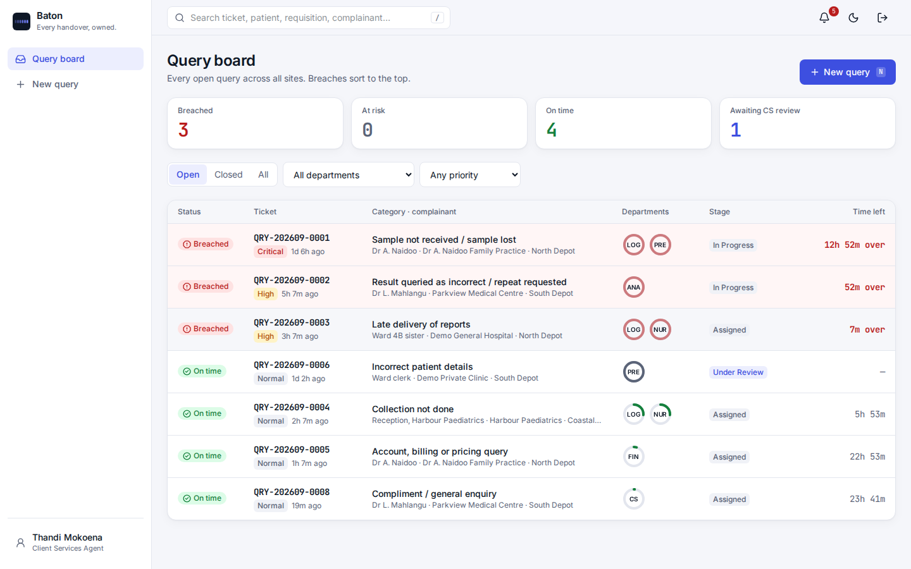
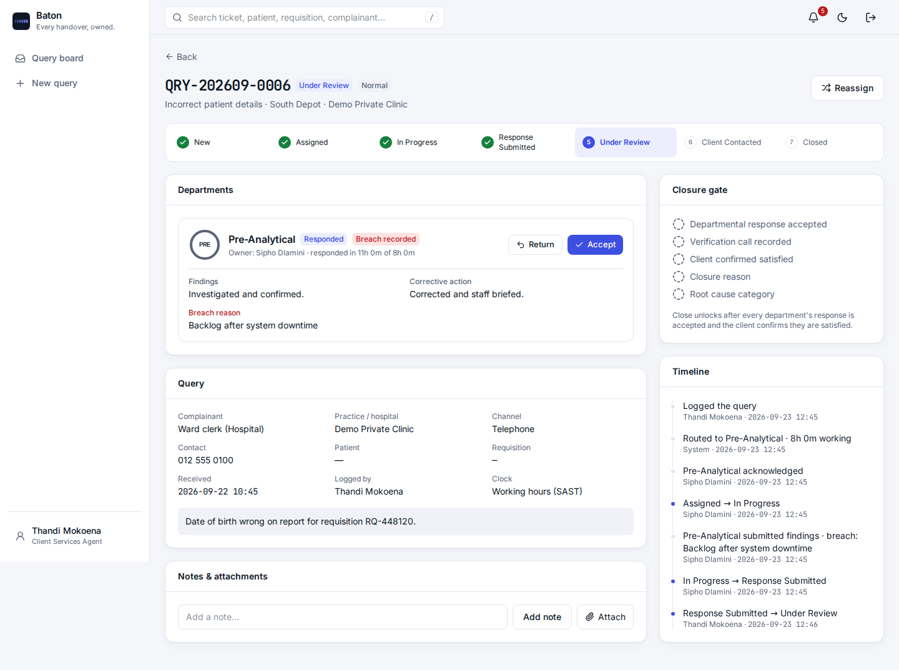
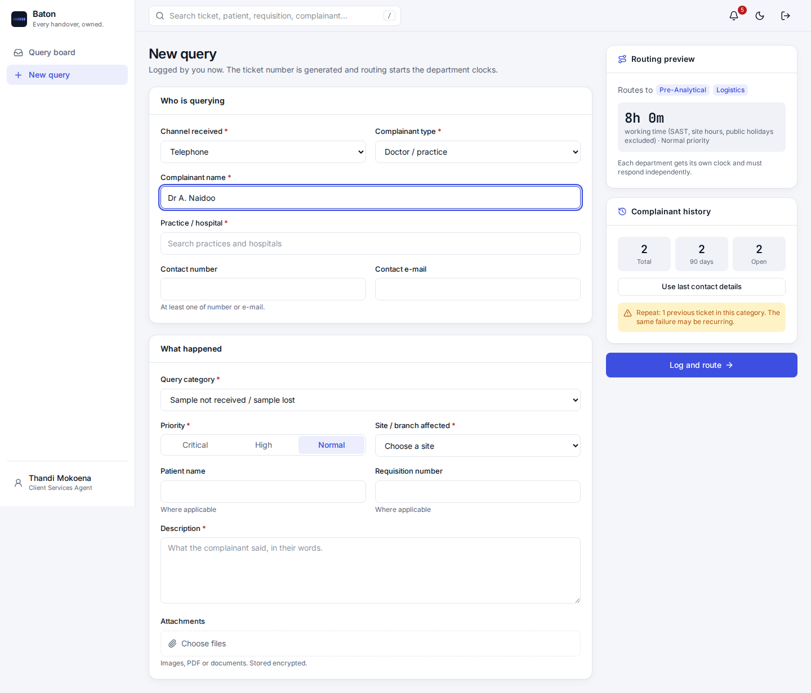

# Baton

**Every handover, owned.** Query and hospital-bleed ticketing for JDJ. It runs on-premise with Docker.

Every query and every bleed gets a ticket number, a named owner at each stage and a time stamp at each handover. Each clock warns before it goes red.



| Module | Status |
|---|---|
| Foundation: RBAC, local + AD sign-in with TOTP, hash-chained audit, admin configuration | ✅ Phase 1 |
| Module A: query and ticket management | ✅ Phase 1 |
| Module B: hospital bleed tickets + field PWA (geofence, encrypted photos, offline) | Phase 2 |
| Central dashboard: live boards, analytics, Excel export, scheduled e-mails, Wall mode | Phase 3 |
| Insights, retention jobs, Android wrap with mock-location detection | Phase 4 |

| Ticket: department clocks, closure gate, audited timeline | Intake: live routing preview and repeat-complainant warning |
|---|---|
|  |  |

## On-premise install

Requirements: Docker Engine 24+ with Compose v2, and a DNS name for the server (e.g. `baton.jdj.local`).

```sh
cp .env.example .env        # set SITE_ADDRESS, APP_URL, ADMIN_PASSWORD, SMTP_*, LDAP_*
./scripts/init.sh           # generates secrets/, builds, starts, creates the administrator
```

The stack has five containers:

| Container | Role |
|---|---|
| `web` | Caddy: TLS, security headers, serves the PWA, proxies `/api` |
| `api` | Fastify API; runs database migrations on start |
| `worker` | SLA escalation every minute and session clean-up; one active worker via advisory lock |
| `db` | PostgreSQL 16, the only stateful service |
| `backup` | nightly `pg_dump` + attachment store, kept for 14 days, in the `backups` volume |

> **Back up `secrets/master_key` separately.** Attachments and bleed photos are encrypted with it. Backups do not contain it, and without it they cannot be decrypted.

**Air-gapped sites:**
1. Build on a connected machine.
2. `docker save baton-api baton-web postgres:16-alpine caddy:2-alpine | gzip > baton.tgz`.
3. `docker load` on the server.

**TLS:**
- Hostnames under `.local` or `.internal` get a certificate from Caddy's internal CA. Distribute its root certificate (in the `caddy_data` volume) to devices.
- To use your own certificate, add `tls /certs/cert.pem /certs/key.pem` to `docker/Caddyfile` and mount the files.

**Active Directory:**
1. Set `LDAP_URL` (LDAPS), `LDAP_BASE_DN` and `LDAP_UPN_SUFFIX`.
2. In **Administration → AD group mapping**, map security groups to a role and department.

Users sign in with their network login, and accounts are created on first sign-in. Nested groups are resolved.

## Development

```sh
npm install
# a Postgres 16 you can reach; defaults to postgres://baton@127.0.0.1:5433/baton
npm run seed -w @baton/api -- --demo   # reference data from the brief + demo users/tickets
MASTER_KEY=$(head -c32 /dev/urandom | base64) npm run dev:api
npm run dev:web                        # http://localhost:5173
TEST_DATABASE_URL=postgres://baton@127.0.0.1:5433/baton_test npm test
```

Demo accounts (password `Baton!demo2026`; two-factor is relaxed in demo seed only):

| E-mail | Role |
|---|---|
| agent@baton.local | Client Services Agent |
| supervisor@baton.local | Client Services Supervisor |
| preanalytical@baton.local / analytical@ / logistics@ / nursing@ | Department Responder |
| manager.pre@baton.local | Department Manager (Pre-Analytical) |
| exec@baton.local | Management (read-only) |
| admin@baton.local (`ChangeMe!2026`) | System Administrator |

## Architecture

```
packages/core   Shared rules, used by server (enforcement) and browser (display):
                query state machine, closure gate, SLA/business-hours clock (SAST),
                RBAC matrix, enums
apps/api        Fastify + postgres.js (plain SQL, numbered migrations), bundled with esbuild
apps/web        React 19 + Vite + TanStack Query + Tailwind v4 (PWA)
```

**Design decisions:**
- **One ticket engine.** A query is a `ticket` with one `assignment` per routed department, and each assignment has its own clock. A bleed (Phase 2) is the same ticket with timed checkpoints.
- **Ticket state is derived** from department assignments (`deriveState`). The only explicit transitions are review, call, close and reopen.
- **Clocks.**
  - Categories run on *working hours*: site hours in SAST, with SA public holidays excluded.
  - Or they run *24/7*.
  - Escalation fires at 80 / 100 / 150 % of the limit; the thresholds are configurable.
  - Once the limit is passed, a department cannot respond without a breach reason.
- **Closure is technically impossible without evidence** (brief §5.4). It's enforced three times:
  - The UI shows exactly what is missing.
  - The API rejects the close.
  - A PostgreSQL trigger rejects a close without a satisfied call in the current cycle, all responses accepted, and a Client Services user as closer, even via direct SQL.
- **Not satisfied / reopen.** The ticket starts a new *cycle* and restarts the chosen departments' clocks. A satisfied call from an earlier cycle cannot close the ticket.

## Security and compliance (POPIA, ISO 15189 traceability)

- **RBAC** per brief §4:
  - Only Client Services can open or close a ticket.
  - Departments see only tickets routed to them.
  - Management is read-only.
  - The administrator configures the system but sees no tickets.
- **Audit trail.** `audit_log` is append-only (a trigger blocks UPDATE and DELETE) and **SHA-256 hash-chained**. Administration → Audit trail verifies the chain on demand.
  - It records every transition with actor, time, reason and IP, plus sign-ins, failed sign-ins and admin changes.
  - Viewing an attachment is logged (read audit).
- **Encryption.** Attachments use AES-256-GCM with a random key per file, wrapped by the master key. Files are only served through an authorised, audited API call, with `no-store`.
- **Authentication.**
  - Passwords are hashed with scrypt.
  - TOTP two-factor is mandatory for Client Services, Management and Admin (configurable).
  - An account locks for 15 min after 5 failures (password or TOTP).
  - Sessions are httpOnly, SameSite=Strict cookies, stored as SHA-256 hashes, with a 12 h sliding expiry.
- **Transport and headers.** HTTPS with HSTS, a strict CSP (no inline scripts), `X-Frame-Options DENY`, and a camera/geolocation permissions policy.
- **Configuration without developers.** Users, AD groups, categories and routing, time limits, sites and hours, holidays, practices and hospitals (with geofence), escalation thresholds and MFA policy can all be changed in **Administration** with no release.

## Open items to confirm with JDJ

1. The final time limits per category and priority (the brief says TBC; defaults are seeded and editable).
2. Brief §8 (offline) is missing from the document. Phase 2 assumes offline checkpoint capture that syncs later.
3. Bleed interval limits (all TBC except reporting at 90 min).
4. LIS integration for requisition validation and "results released" (Phase 2 uses a manual release button, with an interface stub).
